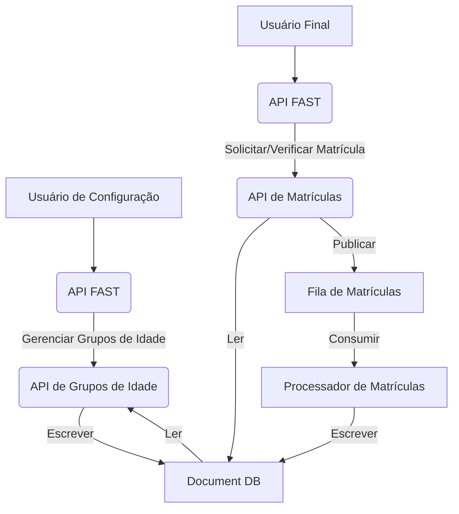

# Sistema de Gerenciamento de Matrículas e Grupos de Idade (Teste Técnico)

Este projeto é uma solução Python que gerencia grupos de idade e matrículas, usando arquitetura de microsserviços, APIs e filas assíncronas. Ele simula serviços AWS localmente com o LocalStack para permitir desenvolvimento e testes rápidos sem precisar da nuvem real.

## Visão Geral do Projeto

O sistema é modular e composto por três componentes principais que interagem entre si:

### APIs RESTful (FastAPI):

- **API de Grupos de Idade**: Responsável por gerenciar as faixas etárias permitidas para matrículas (cadastro, exclusão e consulta).
- **API de Matrículas**: Aceita novas solicitações de matrícula, realiza validações de idade com base nos grupos existentes e publica eventos para processamento posterior.

### Fila de Mensagens (SQS - simulado via LocalStack):

Atua como um buffer entre a API de Matrículas e o Processador, garantindo a resiliência e o desacoplamento dos serviços.

### Processador de Matrículas (Função Lambda - simulada via LocalStack):

Consome as mensagens da fila, executa a lógica de processamento da matrícula (incluindo um tempo mínimo de processamento) e atualiza o status no banco de dados.

## Arquitetura do Sistema



- **Usuário de Configuração**: Gerencia os grupos de idade através da API dedicada.
- **Usuário Final**: Interage com a API de Matrículas para submeter e verificar o status de suas solicitações.
- **API FAST**: O gateway para as funcionalidades do sistema.
- **Document DB (DynamoDB)**: Armazena os grupos de idade e os dados das matrículas.
- **Fila de Matrículas (SQS)**: Garante que as solicitações de matrícula sejam processadas de forma assíncrona.
- **Processador de Matrículas (Lambda)**: Executa a lógica de negócio para cada matrícula.

## Funcionalidades Chave

### API de Grupos de Idade

- **Registro**: Adiciona novas faixas etárias (idade mínima e máxima).
- **Exclusão**: Remove grupos de idade existentes.
- **Consulta**: Lista todos os grupos de idade configurados.

### API de Matrículas

- **Solicitação**: Permite a submissão de matrículas com nome, idade e CPF. A idade é validada contra os grupos de idade registrados.
- **Verificação de Status**: Consulta o status de uma matrícula específica pelo CPF.

### Processador de Matrículas

- Consome mensagens da fila SQS.
- Simula um tempo de processamento mínimo de 2 segundos por matrícula.
- Atualiza o status da matrícula no DynamoDB.

## Tecnologias Utilizadas

- **Python 3.12+**
- **FastAPI**
- **Poetry**
- **Docker & Docker Compose**
- **LocalStack**
- **Pytest**
- **DynamoDB**
- **SQS**
- **AWS Lambda**

## Pré-requisitos

- Python 3.12 ou superior
- Poetry
- Docker Desktop

## Configuração e Execução Local

```bash
# Clone o Repositório
git clone https://github.com/StharleyMax/age-groups.git
cd age-groups

# Crie e Ative o Ambiente Virtual
python -m venv .env
source .env/bin/activate  # Windows: .env\Scripts\activate

# Instale as Dependências
poetry install

# Configure as Variáveis de Ambiente (.env)
AWS_ENDPOINT=http://localhost:4566
AWS_REGION=us-east-1
AWS_ACCESS_KEY_ID=test
AWS_SECRET_ACCESS_KEY=test
USERNAME=admin
PASSWORD=admin
```

## Execução com docker
```bash
# Configure as Variáveis de Ambiente (.env)
AWS_ENDPOINT=http://localhost:4566
AWS_REGION=us-east-1
AWS_ACCESS_KEY_ID=test
AWS_SECRET_ACCESS_KEY=test
USERNAME=admin
PASSWORD=admin

make start
```

## Testes
Para executar o teste é preciso que o ambiente de localstack esteja online
```bash
# Executar Todos os Testes
make test
```

## Autenticação

As APIs são protegidas por autenticação Basic Auth. As credenciais são carregadas do arquivo `.env`.

## Estrutura do Projeto

```
.
├── config/
│   └── settings.py
├── docker-compose.yml
├── Dockerfile
├── infra/
│   └── localstack/
│       └── init.sh       # Script de inicialização da infra
├── main.py
├── Makefile
├── poetry.lock
├── processor.py
├── pyproject.toml
├── README.md
└── src/
    ├── app.py
    ├── domains/
    │   ├── age_groups/
    │   │   ├── api/
    │   │   │   └── endpoints.py
    │   │   └── schema/
    │   │       └── age_group.py
    │   └── enrollments/
    │       ├── api/
    │       │   └── endpoints.py
    │       ├── processor.py
    │       └── services/
    │           └── enrollment_service.py
    ├── routes.py
    └── shared/
        ├── auth.py
        ├── dependencies.py
        ├── infra/
        │   ├── broker/
        │   │   ├── base_handler.py
        │   │   └── sqs.py
        │   └── database/
        │       ├── dynamodb.py
        │       └── repository/
        │           ├── age_group_repository.py
        │           └── enrollment_repository.py
        └── singleton.py
```

## Comandos Úteis (Makefile)

- `make lint`: Executa o linting.
- `make lint-fix`: Corrige problemas de linting.
- `make test`: Executa os testes de integração.
- `make start`: Sobe a aplicação com o worker, api e localstack.
